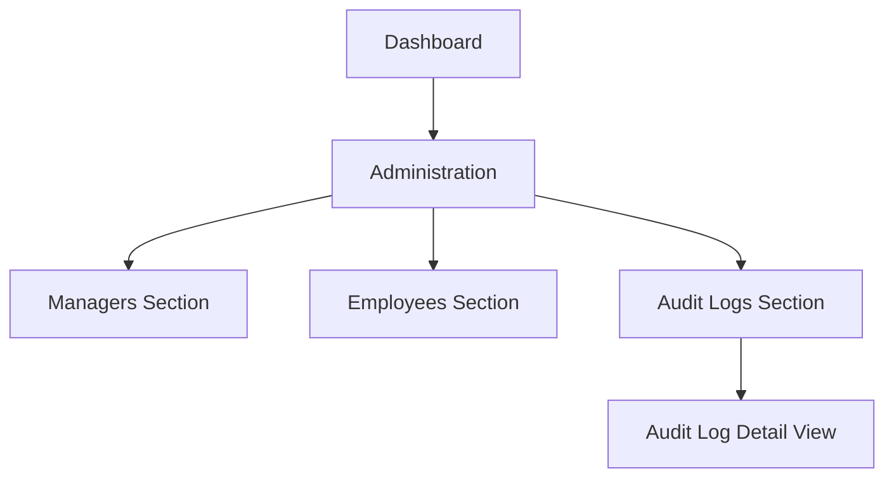

## 1. Product Overview
Streamline the Company Admin “Administration” experience by removing unsafe storage cleanup controls, modernizing the UI for consistency, and making audit logs readable and clearly scoped to the current company.
This improves security, reduces accidental destructive actions, and speeds up admin investigations.

## 2. Core Features

### 2.1 User Roles
| Role | Registration Method | Core Permissions |
|------|---------------------|------------------|
| Company Admin | Existing admin account (internal provisioning) | Manage company users (managers/employees), view company audit logs, manage company settings |
| Platform Super Admin | Existing platform account (internal provisioning) | Platform operations and support; may impersonate/operate within a company context |

### 2.2 Feature Module
Our requirements consist of the following main pages:
1. **Administration**: manager management, employee management, audit log viewer (company-scoped), consistent light/dark UI.

### 2.3 Page Details
| Page Name | Module Name | Feature description |
|-----------|-------------|---------------------|
| Administration | Remove “Storage Cleanup” | Remove screenshot deletion UI and related controls from the company Administration page to prevent destructive actions from this surface. |
| Administration | Modern admin layout | Present content using consistent sections (cards), spacing, typography, and responsive behavior; ensure all controls render correctly in both light and dark themes. |
| Administration | Manager management | Create manager accounts with required fields; list managers; remove manager accounts. |
| Administration | Employee management | List employees within the company; remove employees. |
| Administration | Audit logs (company-scoped) | Show audit log rows that are strictly scoped to the current company; display human-readable actor/target/company details; allow filtering by actor and employee; open full details for a selected event. |

## 3. Core Process
**Company Admin Flow**
1. Open Administration from the sidebar.
2. Create a manager (name, country, timezone, email, password, team name) and confirm creation.
3. Review manager and employee lists; remove entries if needed.
4. Investigate an incident via Audit Logs:
   - Filter by actor (manager/admin) and/or target employee.
   - Scan event list with readable actor/target/company labels.
   - Open a log entry to view full event details.

