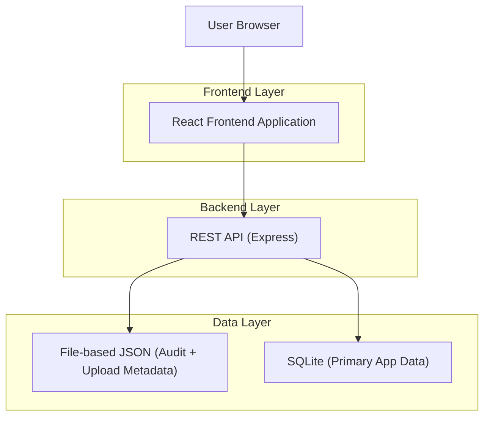
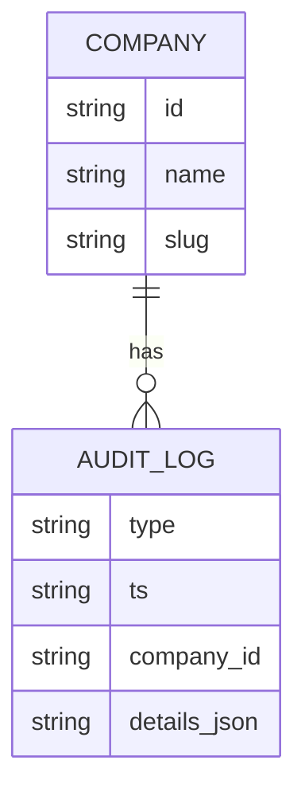

## 1.Architecture design


## 2.Technology Description
- Frontend: React@19 + react-router-dom@6 + tailwindcss@3 + vite
- Backend: Node.js + Express@4
- Database: SQLite (via existing `sqlite.js`) + JSON files for some logs/metadata

## 3.Route definitions
| Route | Purpose |
|-------|---------|
| /:companySlug/admin | Company Administration page (managers, employees, audit logs) |
| /platform | Platform dashboard (super admin) |

## 4.API definitions (If it includes backend services)
### 4.1 Audit Logs (company-scoped)
```
GET /api/admin/audit-logs
```
Request (query params):
| Param Name | Param Type | isRequired | Description |
|-----------|------------|------------|-------------|
| actor | string | false | Filter by actor id/email (maps to stored audit details) |
| employee | string | false | Filter by employee email/id (maps to stored audit details) |
| type | string | false | Filter by event type |
| from | string (ISO) | false | Start time (inclusive) |
| to | string (ISO) | false | End time (inclusive) |

Response (shape):
| Field | Type | Description |
|------|------|-------------|
| logs[] | AuditLogView[] | Enriched, company-scoped audit log records |

TypeScript-style shared types (documentation-level):
```ts
type AuditLog = {
  type: string;
  ts: string; // ISO
  company_id: number | string | null;
  details: Record<string, any>;
};

type AuditActor = {
  id: string | number | null;
  email?: string | null;
  name?: string | null;
  role?: string | null;
};

type AuditTargetEmployee = {
  email?: string | null;
  name?: string | null;
  managerId?: string | number | null;
};

type AuditCompany = {
  id: number | string;
  name?: string;
  slug?: string;
};

type AuditLogView = AuditLog & {
  ts_local?: string | null;
  timezone?: string;
  company?: AuditCompany;
  actor?: AuditActor;
  targetEmployee?: AuditTargetEmployee;
  summary?: string; // short human-readable description
};
```

## 6.Data model(if applicable)
### 6.1 Data model definition


### 6.2 Data Definition Language
N/A (audit logs are currently persisted as JSON in `data/audit_logs.json`).

---

## Implementation Plan (high-level)
1. **Remove storage cleanup from company admin UI**: delete the “Storage Cleanup” section and related state/actions from the Administration page.
2. **Admin UI modernization**: refactor Administration into smaller components (Managers, Employees, AuditLogs); standardize cards/tables/empty-states; ensure controls are readable in dark mode.
3. **Audit log enrichment** (backend): keep strict `company_id` filtering; enrich each record with company name/slug, actor display info, and target employee info using existing user/company sources.
4. **Audit log rendering** (frontend): update table columns to show company-scoped details (actor name/email, target employee name/email, readable summary); provide a detail view for full `