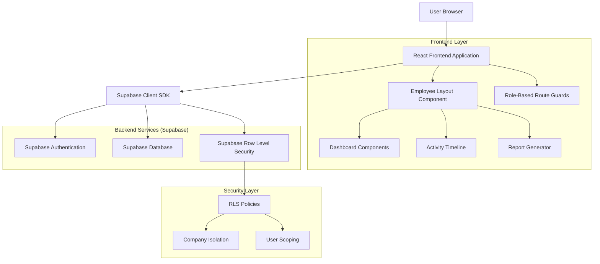
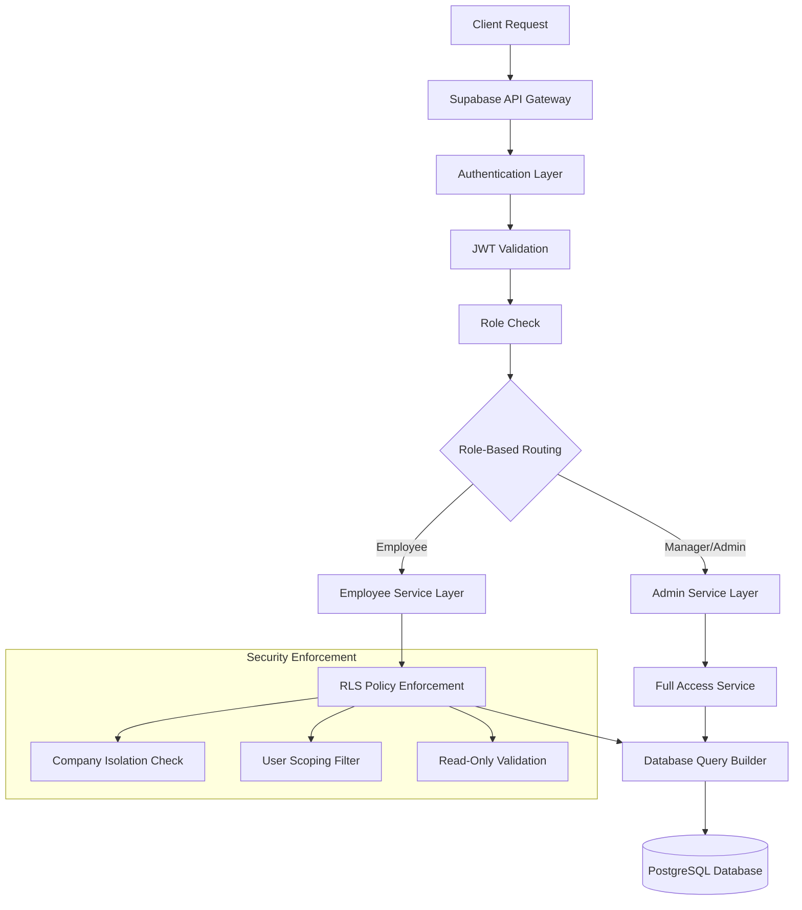
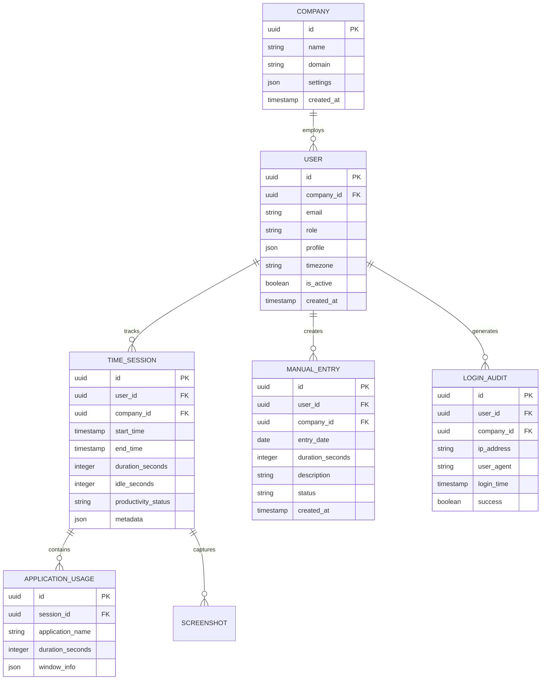

## 1. Architecture Design



## 2. Technology Description
- Frontend: React@18 + TypeScript + TailwindCSS@3 + Vite
- Initialization Tool: vite-init
- Backend: Supabase (PostgreSQL, Authentication, RLS)
- State Management: React Context + Supabase Real-time
- UI Components: Existing SaaS component library
- Charts: Recharts for data visualization
- Reports: jsPDF + PapaParse for PDF/CSV generation

## 3. Route Definitions
| Route | Purpose |
|-------|---------|
| /employee/dashboard | Employee personal dashboard with time summaries and productivity metrics |
| /employee/activity | Personal activity timeline with tracked sessions and manual entries |
| /employee/reports | Personal report generation and download center |
| /employee/profile | Employee profile settings and timezone configuration |
| /login | Authentication page with role-based redirect |

## 4. API Definitions

### 4.1 Employee Data APIs
```
GET /api/employee/dashboard-summary
```
Request Headers:
- Authorization: Bearer {jwt_token}

Response:
```json
{
  "daily_hours": 8.5,
  "weekly_hours": 42.3,
  "monthly_hours": 156.7,
  "productivity_score": 85,
  "recent_sessions": [
    {
      "id": "session_123",
      "start_time": "2024-01-26T09:00:00Z",
      "end_time": "2024-01-26T17:30:00Z",
      "duration": 30600,
      "idle_time": 1800,
      "productivity_status": "productive"
    }
  ]
}
```

```
GET /api/employee/activity-timeline
```
Request Parameters:
| Param Name | Param Type | isRequired | Description |
|------------|-------------|-------------|-------------|
| start_date | string | false | Start date in ISO format |
| end_date | string | false | End date in ISO format |
| limit | number | false | Number of records to return |

Response:
```json
{
  "activities": [
    {
      "id": "activity_456",
      "type": "tracked_session",
      "start_time": "2024-01-26T09:00:00Z",
      "end_time": "2024-01-26T17:30:00Z",
      "duration": 30600,
      "applications": [
        {"name": "VS Code", "duration": 14400},
        {"name": "Chrome", "duration": 10800}
      ],
      "screenshots": 45,
      "manual_entry": null
    }
  ],
  "total_count": 156
}
```

```
POST /api/employee/generate-report
```
Request Body:
```json
{
  "report_type": "monthly_summary",
  "start_date": "2024-01-01",
  "end_date": "2024-01-31",
  "format": "pdf"
}
```

Response:
```json
{
  "report_id": "report_789",
  "download_url": "https://storage.supabase.co/reports/employee/report_789.pdf",
  "expires_at": "2024-01-27T00:00:00Z"
}
```

### 4.2 Authentication & Authorization
```
POST /api/auth/employee-login
```
Request:
```json
{
  "email": "employee@company.com",
  "password": "secure_password",
  "company_id": "company_123"
}
```

Response:
```json
{
  "access_token": "eyJhbGc...",
  "refresh_token": "eyJhbGc...",
  "user": {
    "id": "user_456",
    "email": "employee@company.com",
    "role": "employee",
    "company_id": "company_123",
    "timezone": "America/New_York"
  }
}
```

## 5. Server Architecture Diagram



## 6. Data Model

### 6.1 Database Schema


### 6.2 Data Definition Language

```sql
-- Companies table
CREATE TABLE companies (
  id UUID PRIMARY KEY DEFAULT gen_random_uuid(),
  name VARCHAR(255) NOT NULL,
  domain VARCHAR(255) UNIQUE,
  settings JSONB DEFAULT '{}',
  created_at TIMESTAMP WITH TIME ZONE DEFAULT NOW()
);

-- Users table with role-based access
CREATE TABLE users (
  id UUID PRIMARY KEY DEFAULT gen_random_uuid(),
  company_id UUID NOT NULL REFERENCES companies(id),
  email VARCHAR(255) UNIQUE NOT NULL,
  password_hash VARCHAR(255) NOT NULL,
  role VARCHAR(50) NOT NULL CHECK (role IN ('employee', 'manager', 'admin')),
  profile JSONB DEFAULT '{}',
  timezone VARCHAR(50) DEFAULT 'UTC',
  is_active BOOLEAN DEFAULT true,
  created_at TIMESTAMP WITH TIME ZONE DEFAULT NOW(),
  updated_at TIMESTAMP WITH TIME ZONE DEFAULT NOW()
);

-- Time tracking sessions
CREATE TABLE time_sessions (
  id UUID PRIMARY KEY DEFAULT gen_random_uuid(),
  user_id UUID NOT NULL REFERENCES users(id),
  company_id UUID NOT NULL REFERENCES companies(id),
  start_time TIMESTAMP WITH TIME ZONE NOT NULL,
  end_time TIMESTAMP WITH TIME ZONE,
  duration_seconds INTEGER,
  idle_seconds INTEGER DEFAULT 0,
  productivity_status VARCHAR(50),
  metadata JSONB DEFAULT '{}',
  created_at TIMESTAMP WITH TIME ZONE DEFAULT NOW()
);

-- Application usage tracking
CREATE TABLE application_usage (
  id UUID PRIMARY KEY DEFAULT gen_random_uuid(),
  session_id UUID NOT NULL REFERENCES time_sessions(id),
  application_name VARCHAR(255) NOT NULL,
  duration_seconds INTEGER NOT NULL,
  window_info JSONB DEFAULT '{}',
  created_at TIMESTAMP WITH TIME ZONE DEFAULT NOW()
);

-- Manual time entries
CREATE TABLE manual_entries (
  id UUID PRIMARY KEY DEFAULT gen_random_uuid(),
  user_id UUID NOT NULL REFERENCES users(id),
  company_id UUID NOT NULL REFERENCES companies(id),
  entry_date DATE NOT NULL,
  duration_seconds INTEGER NOT NULL,
  description TEXT,
  status VARCHAR(50) DEFAULT 'pending' CHECK (status IN ('pending', 'approved', 'rejected')),
  created_at TIMESTAMP WITH TIME ZONE DEFAULT NOW(),
  updated_at TIMESTAMP WITH TIME ZONE DEFAULT NOW()
);

-- Login audit trail
CREATE TABLE login_audits (
  id UUID PRIMARY KEY DEFAULT gen_random_uuid(),
  user_id UUID NOT NULL REFERENCES users(id),
  company_id UUID NOT NULL REFERENCES companies(id),
  ip_address INET,
  user_agent TEXT,
  login_time TIMESTAMP WITH TIME ZONE DEFAULT NOW(),
  success BOOLEAN NOT NULL
);

-- Row Level Security Policies
ALTER TABLE time_sessions ENABLE ROW LEVEL SECURITY;
ALTER TABLE manual_entries ENABLE ROW LEVEL SECURITY;
ALTER TABLE users ENABLE ROW LEVEL SECURITY;

-- Employee access policies (read-only, own data only)
CREATE POLICY "Employees can view own time sessions" ON time_sessions
  FOR SELECT USING (
    auth.uid() = user_id AND 
    EXISTS (
      SELECT 1 FROM users 
      WHERE users.id = auth.uid() 
      AND users.role = 'employee'
    )
  );

CREATE POLICY "Employees can view own manual entries" ON manual_entries
  FOR SELECT USING (
    auth.uid() = user_id AND 
    EXISTS (
      SELECT 1 FROM users 
      WHERE users.id = auth.uid() 
      AND users.role = 'employee'
    )
  );

-- Indexes for performance
CREATE INDEX idx_time_sessions_user_company ON time_sessions(user_id, company_id);
CREATE INDEX idx_time_sessions_start_time ON time_sessions(start_time DESC);
CREATE INDEX idx_manual_entries_user_company ON manual_entries(user_id, company_id);
CREATE INDEX idx_login_audits_user_time ON login_audits(user_id, login_time DESC);

-- Grant permissions
GRANT SELECT ON time_sessions