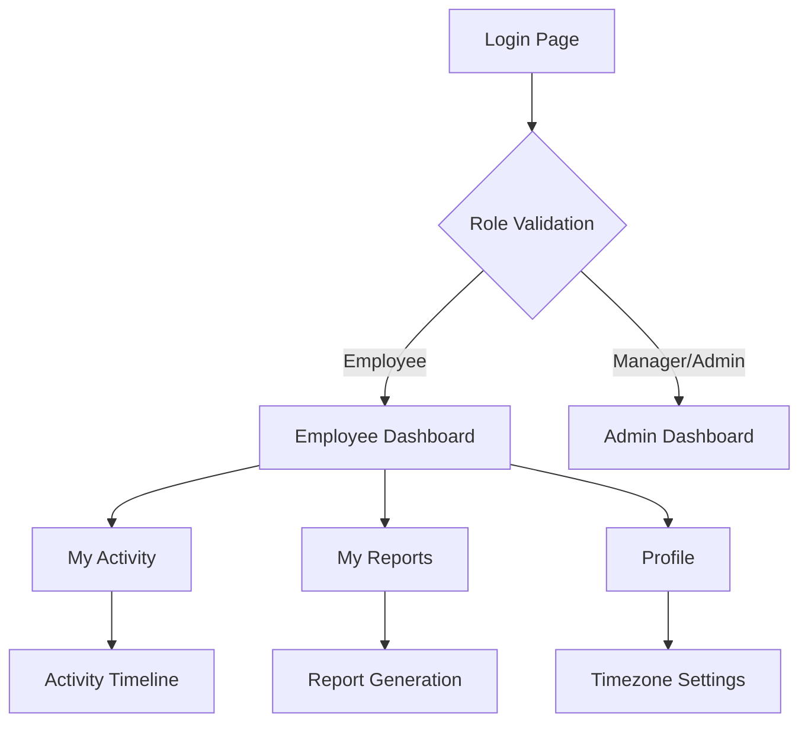

## 1. Product Overview
Employee Self-Service Web Dashboard for multi-tenant Time Tracker SaaS application. Provides employees with secure, read-only access to their personal time tracking data and productivity metrics while maintaining strict role-based access control and company isolation.

This feature empowers employees to monitor their own work hours, activity timelines, and productivity summaries without accessing sensitive team or administrative data, enhancing transparency and self-service capabilities within the existing SaaS platform.

## 2. Core Features

### 2.1 User Roles
| Role | Registration Method | Core Permissions |
|------|---------------------|------------------|
| Employee | Admin/Manager invitation | Read-only access to own data, download personal reports, view personal dashboard |
| Manager | Admin assignment | Full team management, reporting, user oversight |
| Admin | System setup | Full system administration, billing, settings, all company data |

### 2.2 Feature Module
Employee Self-Service Dashboard consists of the following main pages:
1. **Dashboard**: Personal overview with daily/weekly/monthly work hours, productivity summary, recent activity timeline.
2. **My Activity**: Detailed activity timeline showing tracked sessions, idle time, approved manual entries with filtering options.
3. **My Reports**: Personal report generation and download center with customizable date ranges and report types.
4. **Profile**: Personal settings including timezone preferences, basic information display.

### 2.3 Page Details
| Page Name | Module Name | Feature description |
|-----------|-------------|---------------------|
| Dashboard | Personal Overview | Display daily, weekly, and monthly work hours summary with visual charts. Show productivity metrics and recent activity timeline. |
| Dashboard | Quick Stats | Show current day status, week-to-date hours, month-to-date hours with progress indicators. |
| My Activity | Activity Timeline | List all tracked sessions with start/end times, duration, idle time, and manual entries. Include filtering by date range and activity type. |
| My Activity | Session Details | Expandable session information showing application usage, screenshots (if enabled), and productivity classification. |
| My Reports | Report Generation | Generate downloadable PDF/CSV reports with customizable date ranges (daily, weekly, monthly, custom). |
| My Reports | Report History | Show previously generated reports with download links and generation timestamps. |
| Profile | Personal Information | Display employee name, email, employee ID, and role. Show read-only basic company information. |
| Profile | Timezone Settings | Allow employee to set and update their preferred timezone for data display. |

## 3. Core Process
**Employee Login Flow**: Employee navigates to login page → Enters credentials → System validates role and company → Redirects to Employee Dashboard → Loads personal data scoped by user_id and company_id → Displays read-only dashboard with timezone-adjusted timestamps.

**Data Access Flow**: Employee clicks navigation item → Frontend requests data via read-only API → Backend validates employee role and scopes query by both company_id and user_id → Returns filtered personal data → Frontend displays in existing UI components with employee-specific layout.

**Report Generation Flow**: Employee selects report type and date range → Frontend sends request to report generation endpoint → Backend validates permissions and generates report containing only employee's data → Provides secure download link → Employee downloads report.

## 4. User Interface Design

### 4.1 Design Style
- **Primary Colors**: Maintain existing SaaS color scheme with employee-specific accent color
- **Button Style**: Rounded corners, consistent with existing design system
- **Font**: Inter or current SaaS font family, 14-16px for body text, 18-24px for headers
- **Layout Style**: Card-based layout with clean spacing, consistent with existing components
- **Icons**: Use existing icon library (Heroicons or similar) for consistency

### 4.2 Page Design Overview
| Page Name | Module Name | UI Elements |
|-----------|-------------|-------------|
| Dashboard | Personal Overview | Time summary cards with progress bars, line chart for weekly hours, activity feed with timestamps, responsive grid layout with 3-column desktop, 1-column mobile. |
| My Activity | Activity Timeline | Scrollable timeline with session cards showing duration, productivity status, expandable details, date picker for filtering, search functionality. |
| My Reports | Report Center | Card-based report options, date range selector, generate button with loading state, report history table with download icons. |
| Profile | Settings Panel | Form inputs for timezone selection, read-only information cards, save button with validation feedback. |

### 4.3 Responsiveness
Desktop-first design with mobile adaptation. Dashboard uses responsive grid system (3-column desktop, 2-column tablet, 1-column mobile). All charts and data visualizations adapt to screen size. Touch-optimized interactions for mobile devices with appropriate tap targets and swipe gestures for timeline navigation.

### 4.4 Security & Access Control
All employee dashboard routes protected by authentication middleware. API endpoints enforce strict RBAC with employee role validation. Database queries always include both company_id and user_id filters. No access to team data, billing information, or administrative functions. Session management with automatic timeout