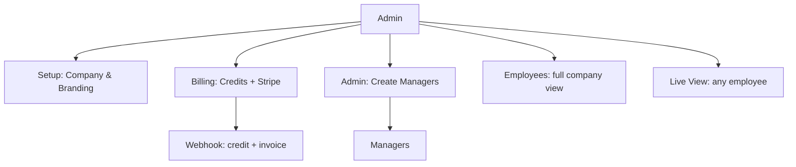
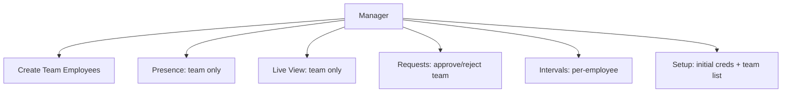
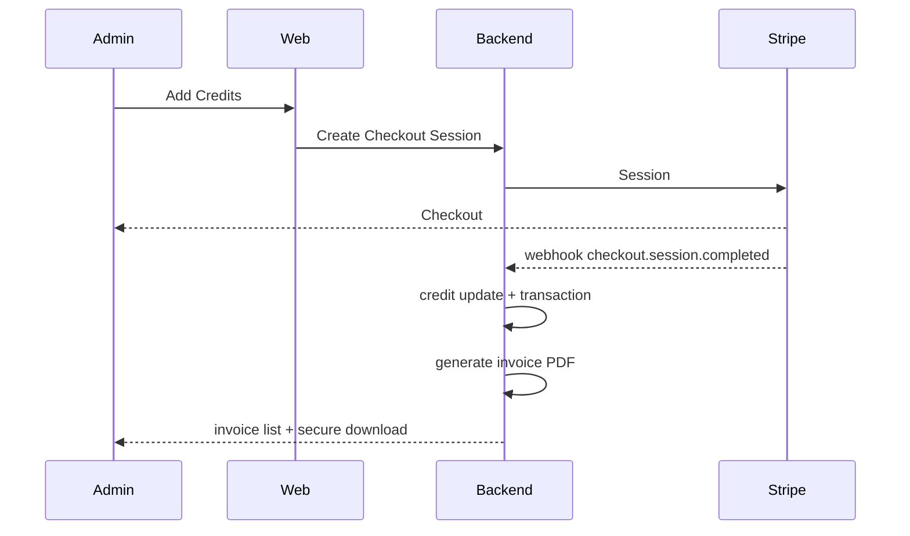
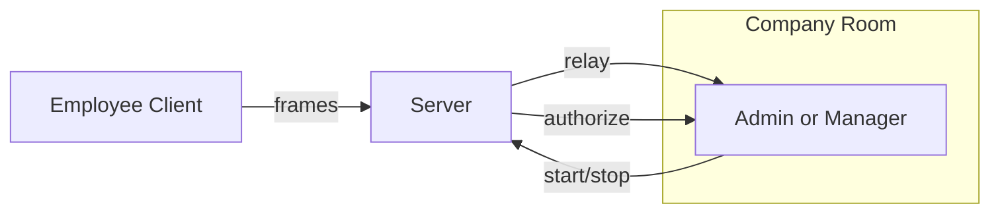

# Time Tracker System

Multi-tenant, enterprise-grade time tracking and productivity monitoring with strict role-based isolation, modern SaaS UI, real-time observability, and audit-ready billing.

**Roles**
- Super Admin: full company view, billing, invoices, live tracking, manager and employee administration.
- Manager: team-scoped view; can create employees, configure intervals, approve/reject requests, live-view team only.
- Employee: self service; requests, personal dashboard, desktop client.

**Isolation**
- Tenant isolation: all data scoped by `company_id`.
- Team isolation: all manager queries scoped by `manager_id` via team membership.
- Real-time isolation: Socket.IO company rooms; viewer permissions checked against team membership.

## Features

- Multi-tenant company workspaces
- Role-based access control (Admin/Manager/Employee)
- Team-scoped dashboards, presence, live view, activity, reports
- Work Hours & screenshot interval management (per employee)
- Time Requests workflow (employee → manager approve/reject)
- Credits billing with Stripe checkout and atomic deductions
- Professional invoices (PDF) with company branding and secure download
- Organization Setup with manager/employee initial credentials views
- Real-time updates (credits, presence, intervals) via Socket.IO
- Audit logging for sensitive operations (invoice, interval changes, approvals)

## Architecture

- Frontend: React + Vite + Tailwind; JWT auth; role-aware pages
- Backend: Node.js + Express; REST + Socket.IO; PDFKit for invoices
- Storage: SQLite (better-sqlite3) with JSON fallback for dev
- Payments: Stripe Checkout and webhooks

## Data Model (summary)

- `companies(id, name, plan, credits, created_at)`
- `users(id, company_id, email, password_hash, role, timezone, created_at)`
- `organizations/teams(id, company_id, name, manager_id, created_at)`
- `employees(id, company_id, user_id, team_id, manager_id, email, name, created_at)`
- `work_sessions(company_id, team_id, employee_id, started_at, ended_at, created_at)`
- `intervals(employeeEmail → seconds)` (JSON doc)
- `transactions(id, company_id, amount, credits, type, description, reference_id, status, created_at)`
- `invoices(id, company_id, invoice_no, invoice_id, company_name, logo, billing_email, invoice_date, billing_period, line_items, subtotal, tax, total, currency, provider, reference_id, status, pdf_path, created_at)`
- `time_requests(id, company_id, employee_id, date, start_time, end_time, reason, status, created_at)`
- `employee_creds(company_id, employee_email, temp_password, created_at)`
- `manager_creds(company_id, manager_email, temp_password, created_at)`

## Security & Isolation Guarantees

- All queries include `company_id`; manager queries additionally filter by `manager_id`.
- Server-side authorization; frontend never relied upon for scoping.
- Socket rooms per company; live view Start/Stop verified against team membership.

## Billing & Invoices

- Admin purchases credits via Stripe Checkout → webhook confirms payment
- Atomic credit update and transaction write
- Sequential per-company invoice generated (PDFKit) with branding
- Secure `GET /api/billing/invoices/:invoice_id/download` streams PDF with proper headers

## API Scoping Examples

- Admin employees: `SELECT * FROM employees WHERE company_id = :company_id`
- Manager employees: `SELECT * FROM employees WHERE company_id = :company_id AND manager_id = :uid`
- Manager requests: filter `time_requests` by `employee_id` ∈ team employee IDs
- Intervals update: manager must own `employee_id`; emits `interval:assigned`

## Visual Diagrams

### Admin Overview



### Manager Team Isolation



### Billing & Invoice Flow



### Live View Permissions



## Installation & Setup

Prerequisites
- Node.js 18+
- npm

Backend
```bash
cd backend
npm install
npm install better-sqlite3
```

Environment (`backend/.env`)
```env
PORT=4000
HOST=127.0.0.1
JWT_SECRET=your_super_secure_secret_key
ALLOWED_ORIGINS=http://localhost:5173
UPLOAD_DIR=uploads
DATA_DIR=data
STRIPE_SECRET_KEY=sk_...
STRIPE_WEBHOOK_SECRET=whsec_...
```

Start
```bash
npm start
```

Frontend
```bash
cd web
npm install
npm run dev
```

## Directory Structure

```
├── backend/            # Express Server & API
│   ├── src/            # routes, sockets, billing, invoices
│   ├── uploads/        # screenshots
│   └── public/         # downloads
├── web/                # React Frontend
│   ├── src/            # components & pages
│   └── dist/           # build output
├── desktop/            # Python client
└── data/               # sqlite/json
```

## Contributing
- Fork, branch, PR

© 2026 Time Tracker System. All rights reserved.
